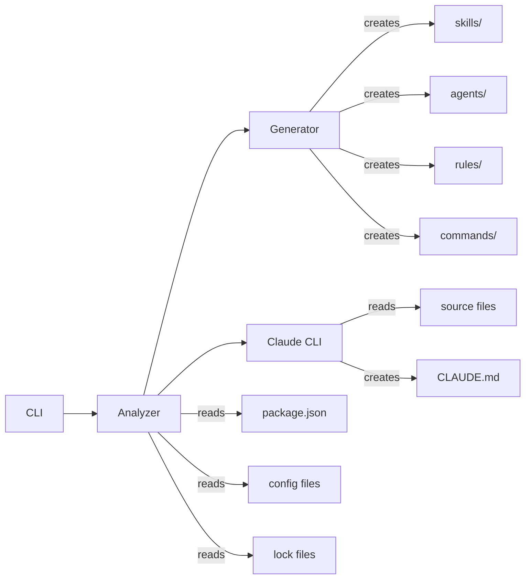

# Claude Code Starter

[](https://github.com/cassmtnr/claude-code-starter/actions/workflows/pr-check.yml)
[](https://codecov.io/gh/cassmtnr/claude-code-starter)
[](https://www.npmjs.com/package/claude-code-starter)
[](https://opensource.org/licenses/MIT)
[](https://nodejs.org/)
[](https://bun.sh/)

Intelligent CLI that uses Claude to deeply analyze your project and generate tailored Claude Code configurations.

## Quick Start

```bash
cd your-project
npx claude-code-starter
claude
```

**Requires [Claude CLI](https://claude.ai/download) to be installed.**

## What It Does

1. **Analyzes your repository** - Detects languages, frameworks, tools, and patterns
2. **Launches Claude CLI** - Claude reads your actual source files and understands your architecture
3. **Generates a professional CLAUDE.md** - Project-specific documentation with architecture, conventions, and patterns
4. **Creates supporting configurations** - Skills, agents, rules, and commands tailored to your stack

## How It Works

```
npx claude-code-starter
  |
  ├── 1. Detect tech stack (languages, frameworks, tools)
  ├── 2. Generate supporting files (skills, agents, rules, commands)
  ├── 3. Launch Claude CLI for deep project analysis
  │     └── Claude reads source files → understands architecture → writes CLAUDE.md
  └── 4. Done! Run `claude` to start working
```

The key difference from static scaffolding tools: Claude actually **reads your codebase** and generates documentation specific to your project's architecture, patterns, conventions, and domain knowledge.

## Tech Stack Detection

Automatically detects and configures for:

| Category       | Detected                                                            |
| -------------- | ------------------------------------------------------------------- |
| **Languages**  | TypeScript, JavaScript, Python, Go, Rust, Java, Ruby, Swift, Kotlin |
| **Frameworks** | Next.js, React, Vue, Svelte, FastAPI, Django, NestJS, Express, etc. |
| **Tools**      | npm, yarn, pnpm, bun, pip, cargo, go modules                        |
| **Testing**    | Jest, Vitest, Pytest, Go test, Rust test                            |
| **Linting**    | ESLint, Biome, Ruff, Pylint                                         |

## Generated Configurations

Based on your stack, creates:

- **CLAUDE.md** - Comprehensive project documentation generated by Claude's deep analysis of your codebase
- **Skills** - Framework-specific patterns (e.g., Next.js App Router, FastAPI endpoints)
- **Agents** - Specialized assistants (code reviewer, test writer)
- **Rules** - Language conventions (TypeScript strict mode, Python PEP 8)
- **Commands** - Workflow shortcuts (`/task`, `/status`, `/done`, `/analyze`, `/code-review`)

## Commands

| Command           | Description                             |
| ----------------- | --------------------------------------- |
| `/task <desc>`    | Start a new task                        |
| `/status`         | Show current task                       |
| `/done`           | Mark task complete                      |
| `/analyze <area>` | Deep dive into code                     |
| `/code-review`    | Review changes for quality and security |

## CLI Options

```bash
npx claude-code-starter           # Interactive mode
npx claude-code-starter -y        # Non-interactive (use defaults)
npx claude-code-starter -f        # Force overwrite existing files
npx claude-code-starter -V        # Verbose output
npx claude-code-starter --help    # Show help
```

## Example Output

```
Claude Code Starter v0.4.1
Intelligent AI-Assisted Development Setup

Analyzing repository...

Tech Stack
  Language: TypeScript
  Framework: Next.js
  Package Manager: bun
  Testing: vitest

Existing project with 42 source files

Generating supporting configuration...

Created:
  + .claude/settings.json
  + .claude/skills/pattern-discovery.md
  + .claude/skills/nextjs-patterns.md
  ...

Launching Claude for deep project analysis...
Claude will read your codebase and generate a comprehensive CLAUDE.md

Claude analysis complete!

Done! (15 files)

Generated for your stack:
  CLAUDE.md (deep analysis by Claude)
  9 skills (pattern-discovery, iterative-development, security, nextjs-patterns, ...)
  2 agents (code-reviewer, test-writer)
  2 rules

Next step: Run claude to start working!
```

## Project Structure

After running, your project will have:

```
.claude/
├── CLAUDE.md           # Project-specific docs (generated by Claude analysis)
├── settings.json       # Permissions configuration
├── agents/             # Specialized AI agents
│   ├── code-reviewer.md
│   └── test-writer.md
├── commands/           # Slash commands
│   ├── task.md
│   ├── status.md
│   ├── done.md
│   ├── analyze.md
│   └── code-review.md
├── rules/              # Code style rules
│   ├── typescript.md   # (or python.md, etc.)
│   └── code-style.md
├── skills/             # Methodology guides + patterns
│   ├── pattern-discovery.md
│   ├── systematic-debugging.md
│   ├── testing-methodology.md
│   ├── iterative-development.md
│   ├── commit-hygiene.md
│   ├── code-deduplication.md
│   ├── simplicity-rules.md
│   ├── security.md
│   └── nextjs-patterns.md  # (framework-specific)
└── state/
    └── task.md         # Current task tracking
```

## Architecture



### Artifact Generation

| Artifact Type     | Generation Method                                        |
| ----------------- | -------------------------------------------------------- |
| **CLAUDE.md**     | Claude CLI deep analysis of your actual source files     |
| **settings.json** | Generated with safe default permissions                  |
| **Skills**        | Core skills + framework-specific patterns (if detected)  |
| **Agents**        | Code reviewer and test writer agents                     |
| **Rules**         | Language-specific conventions + general code style       |
| **Commands**      | Task workflow commands (/task, /status, /done, /analyze) |

### Conflict Resolution

When running on an existing project with `.claude/` configuration:

| Scenario           | Behavior            |
| ------------------ | ------------------- |
| **New file**       | Created             |
| **Existing file**  | Skipped (preserved) |
| **With `-f` flag** | Overwritten         |
| **state/task.md**  | Always preserved    |

### Framework-Specific Patterns

When a framework is detected, additional skills are generated:

| Framework       | Generated Skill                                      |
| --------------- | ---------------------------------------------------- |
| Next.js         | `nextjs-patterns.md` - App Router, Server Components |
| React           | `react-components.md` - Hooks, component patterns    |
| FastAPI         | `fastapi-patterns.md` - Async endpoints, Pydantic    |
| NestJS          | `nestjs-patterns.md` - Modules, decorators, DI       |
| SwiftUI         | `swiftui-patterns.md` - Declarative UI patterns      |
| UIKit           | `uikit-patterns.md` - View controller patterns       |
| Vapor           | `vapor-patterns.md` - Server-side Swift              |
| Jetpack Compose | `compose-patterns.md` - Compose UI patterns          |
| Android Views   | `android-views-patterns.md` - XML views              |

## Requirements

- **Node.js 18+** (for running via npx)
- **[Claude CLI](https://claude.ai/download)** (for deep project analysis)

## CI/CD

This project uses GitHub Actions for continuous integration and automated releases.

### PR Checks (`.github/workflows/pr-check.yml`)

Every pull request targeting `main` runs:

| Check            | Description                                        |
| ---------------- | -------------------------------------------------- |
| **Lint**         | Biome lint and format validation                   |
| **Type Check**   | TypeScript compilation check                       |
| **Unit Tests**   | Full test suite with Bun                           |
| **Code Quality** | Checks for console.log, `any` types, skipped tests |
| **Build**        | Verifies package builds successfully               |
| **Package Size** | Reports bundle size (warns if > 500KB)             |

### Automated Releases (`.github/workflows/release.yml`)

When code is merged to `main`, semantic-release automatically:

1. Analyzes commit messages (conventional commits)
2. Determines version bump (major/minor/patch)
3. Updates `package.json` version
4. Generates `CHANGELOG.md`
5. Creates GitHub release with notes
6. Publishes to npm registry

### Conventional Commits

Use these prefixes for automatic versioning:

| Prefix                   | Version Bump | Example                        |
| ------------------------ | ------------ | ------------------------------ |
| `feat:`                  | Minor        | `feat: add dark mode support`  |
| `fix:`                   | Patch        | `fix: resolve memory leak`     |
| `perf:`                  | Patch        | `perf: optimize image loading` |
| `BREAKING CHANGE:`       | Major        | `feat!: redesign API`          |
| `docs:`, `chore:`, `ci:` | No release   | `docs: update README`          |

### Required Secrets

Configure these in your GitHub repository settings:

| Secret         | Description              | Required For      |
| -------------- | ------------------------ | ----------------- |
| `NPM_TOKEN`    | npm authentication token | Publishing to npm |
| `GITHUB_TOKEN` | Auto-provided by GitHub  | Creating releases |

To create an npm token:

1. Go to [npmjs.com](https://npmjs.com) -> Access Tokens
2. Generate a new "Automation" token
3. Add it as `NPM_TOKEN` in GitHub repo -> Settings -> Secrets

## Development

```bash
# Install dependencies
bun install

# Run in development mode
bun run dev

# Run tests
bun test

# Build
bun run build

# Lint
bun run lint

# Type check
bun run typecheck
```

## License

MIT License. See [LICENSE](LICENSE) for details.
