<p align="center">
  
</p>

<h3 align="center">AI-Powered MVP Development</h3>

<p align="center">
  <strong>Build an MVP in hours, not months — guided by AI coding agents</strong>
</p>

<p align="center">
  <a href="LICENSE"></a>
  <a href="http://makeapullrequest.com"></a>
  <a href="https://github.com/KhazP/vibe-coding-prompt-template/stargazers"></a>
  <a href="https://github.com/KhazP/vibe-coding-prompt-template/issues"></a>
</p>

<p align="center">
  
  
  
  
  
</p>

---

## The Workflow

Transform any app idea into working code through 5 AI-powered stages:

```mermaid
flowchart LR
    subgraph Phase1[" "]
        A[💡 Idea]
    end

    subgraph Phase2["Research"]
        B[📊 Market Analysis]
    end

    subgraph Phase3["Define"]
        C[📋 PRD]
    end

    subgraph Phase4["Design"]
        D[🏗️ Tech Design]
    end

    subgraph Phase5["Generate"]
        E[🤖 AGENTS.md]
    end

    subgraph Phase6["Build"]
        F[🚀 MVP]
    end

    A --> B --> C --> D --> E --> F

    style A fill:#667eea,stroke:#667eea,color:#fff
    style B fill:#764ba2,stroke:#764ba2,color:#fff
    style C fill:#f093fb,stroke:#f093fb,color:#fff
    style D fill:#4facfe,stroke:#4facfe,color:#fff
    style E fill:#00f2fe,stroke:#00f2fe,color:#000
    style F fill:#43e97b,stroke:#43e97b,color:#000
```



| Stage | What Happens | Output | Time |
|:-----:|--------------|--------|:----:|
|  | Validate market & tech landscape | `research.txt` | 20 min |
|  | Clarify product scope | `PRD.md` | 15 min |
|  | Decide how to build | `TechDesign.md` | 15 min |
|  | Convert docs into agent blueprints | `AGENTS.md` | 10 min |
|  | Generate & test code | **Working MVP** | 1-3 hrs |

---

<p align="center">
  <a href=".claude/README.md">
    
  </a>
</p>

---

## Quick Start

### How It Works

```
┌─────────────────────────────────────────────────────────────────┐
│  1. Copy prompt file  →  2. Answer questions  →  3. Get docs    │
│  4. Feed docs to AI agent  →  5. Ship your MVP                  │
└─────────────────────────────────────────────────────────────────┘
```

| Step | What You Do | Result |
|:----:|-------------|--------|
| 1 | Copy `part1-deepresearch.md`, answer questions | Research doc |
| 2 | Copy `part2-prd-mvp.md`, answer questions | PRD doc |
| 3 | Copy `part3-tech-design-mvp.md`, answer questions | Tech Design doc |
| 4 | Copy `part4-notes-for-agent.md`, generate configs | AGENTS.md + configs |
| 5 | Tell your AI agent: *"Read AGENTS.md and build the MVP"* | **Working MVP** |

> **Automated alternative:** Try the [Vibe-Coding Webapp](https://vibeworkflow.app/#/vibe-coding) to skip the manual copy-pasting.

---

## Prerequisites

###  AI Platform (Choose One)

For the research and planning phases (Parts 1-4):

| Platform | Best For | Link |
|----------|----------|------|
|  | Technical accuracy and reasoning | [claude.ai](https://claude.ai) |
|  | Large context for comprehensive research | [aistudio.google.com](https://aistudio.google.com) |
|  | Iterative research | [chat.openai.com](https://chat.openai.com) |

###  AI Coding Agent (Choose One)

For the build phase (Part 5):

<table>
<tr>
<td width="33%">

**Terminal-Based**
| Tool | Description |
|------|-------------|
|  | Project-aware CLI with session memory |
|  | Free, open source terminal agent |

</td>
<td width="33%">

**IDE-Based**
| Tool | Description |
|------|-------------|
|  | AI editor, reads `AGENTS.md` |
|  | + GitHub Copilot or Cline |
|  | Agent-first IDE |

</td>
<td width="33%">

**No-Code**
| Tool | Description |
|------|-------------|
|  | Fullstack builder |
|  | UI composition |

</td>
</tr>
</table>

###  Basic Requirements

- Any modern browser
- 2-4 hours of time
- Basic computer skills (no coding required)
- Optional: Node.js for terminal-based tools

---

## The 5-Step Workflow

###  Deep Research

<details>
<summary><b>Validate your idea with AI-powered market research</b> — 20-30 min</summary>

**What this does:** Analyzes market opportunity, competitors, and technical feasibility.

**How it works:**
1. Copy the entire `part1-deepresearch.md` file
2. Paste into your chosen AI platform (Claude, Gemini, or ChatGPT)
3. Answer 5-6 questions tailored to your experience level
4. AI generates comprehensive research with market analysis, competitor breakdown, technical recommendations, and cost estimates
5. Save output as `research-[YourAppName].txt`

**Tip:** If your platform supports web search, enable it for up-to-date stats and competitor info.

</details>

###  Product Requirements (PRD)

<details>
<summary><b>Define exactly what you're building</b> — 15-20 min</summary>

**What this does:** Transforms your idea into clear, actionable product specifications.

**How it works:**
1. Copy `part2-prd-mvp.md` into a new AI chat
2. Attach your research findings when prompted
3. Answer questions about core features, target users, success metrics, and UI/UX vision
4. AI creates professional PRD document
5. Save as `PRD-[YourAppName]-MVP.md`

</details>

###  Technical Design

<details>
<summary><b>Plan the technical architecture</b> — 15-20 min</summary>

**What this does:** Decides the best tech stack and implementation approach.

**How it works:**
1. Copy `part3-tech-design-mvp.md` into a new AI chat
2. Attach your PRD (required) and research (optional)
3. Answer questions about platform, complexity tolerance, budget, and timeline
4. AI recommends optimal stack (no-code, low-code, or full-code)
5. Save as `TechDesign-[YourAppName]-MVP.md`

</details>

###  Generate AI Agent Instructions

<details>
<summary><b>Create blueprints for your AI coding assistant</b> — 5-10 min</summary>

**What this does:** Converts all docs into step-by-step coding instructions for AI agents.

**How it works:**
1. Copy `part4-notes-for-agent.md` into a new AI chat
2. Attach PRD and Technical Design documents
3. Ask the AI for a brief plan for the AGENTS structure; review and approve
4. AI generates:
   - `AGENTS.md` — Universal instructions
   - Tool-specific configs based on your choice (CLAUDE.md, .cursorrules, etc.)
5. Save all files in your project root

**Note:** Treat `AGENTS.md` and tool configs as living docs — update them as your project scales.

</details>

###  Build with AI Agent

<details>
<summary><b>Let AI build your MVP</b> — 1-3 hrs</summary>

#### Setup by Tool Type

**Terminal Agents (Claude Code, Gemini CLI)**
```bash
cd your-project
claude "Read AGENTS.md and build the MVP"
# or
gemini "Read AGENTS.md and implement"
```

**IDE Tools (Cursor, VS Code)**
1. Open your project folder in the IDE
2. Add configuration file (.cursorrules or similar)
3. Start with: *"Read AGENTS.md and build the MVP step by step"*

**No-Code Platforms (Lovable, v0)**
1. Go to platform website
2. Paste your PRD content
3. Say: *"Build this MVP following the specifications"*

#### Recommended Loop

```
┌──────────┐     ┌──────────┐     ┌──────────┐
│   Plan   │ --> │ Execute  │ --> │  Verify  │
│ (approve)│     │(one feat)│     │ (test)   │
└──────────┘     └──────────┘     └──────────┘
      ^                                 │
      └─────────────────────────────────┘
```

#### Useful Prompts

| Level | First Prompt |
|-------|--------------|
| **Vibe-coder** | *"Read AGENTS.md and agent_docs. Propose a plan first, wait for approval, then build step by step."* |
| **Developer** | *"Review AGENTS.md and architecture. Propose a Phase 1 plan, get approval, then implement with proper patterns."* |

**Follow-up prompts:**
- *"What's done and what's left?"*
- *"Test [feature] and fix any issues"*
- *"Make it work on mobile"*
- *"Deploy to Vercel/Cloudflare"*

</details>

---

## Final Project Structure

```
your-app/
├── 📁 docs/
│   ├── research-YourApp.txt
│   ├── PRD-YourApp-MVP.md
│   └── TechDesign-YourApp-MVP.md
├── 📁 agent_docs/
│   ├── tech_stack.md
│   ├── code_patterns.md
│   ├── project_brief.md
│   ├── product_requirements.md
│   └── testing.md
├── 📄 AGENTS.md                  # Universal AI instructions
├── 📄 CLAUDE.md                  # Claude Code config (if using)
├── 📄 .cursorrules               # Cursor config (if using)
└── 📁 src/                       # Your application code
```

---

## Deployment

Once your MVP is built, deploy to one of these platforms:

| Platform | Best For | Free Tier |
|----------|----------|:---------:|
|  | Next.js, React, frontend apps | ✓ |
|  | Static sites, edge functions | ✓ |

Both platforms support git-based deployments — push your code and it deploys automatically.

---

## Tool Selection Guide

<details>
<summary><b>Which tools should I use?</b></summary>

| Situation | Recommended Tools |
|-----------|-------------------|
| Complete beginner |  or  → instant hosted apps |
| Learning to code |  or VS Code with Copilot |
| Experienced developer |  or Cursor |
| Budget-limited |  (free) + VS Code |
| Need MVP fast | Lovable → quick prototypes |
| Complex logic | Claude Code → session memory for large codebases |

**When NOT to use these tools:**
- Native mobile or hardware builds — use traditional toolchains
- Regulated workloads (SOC2, HIPAA) — use enterprise solutions
- Safety-critical systems — require deterministic, human-led engineering

</details>

---

## Common Pitfalls

<details>
<summary><b>Avoid these mistakes</b></summary>

| Pitfall | Solution |
|---------|----------|
| Skipping discovery work | Run the Part 1 research prompt first |
| Letting agents ship code alone | Review the diff and run tests before merging |
| Publishing auto-generated UIs without checks | Test accessibility and security before launch |
| Forcing one tool to do everything | Mix tools — IDE + terminal + builder |

</details>

---

## Troubleshooting

<details>
<summary><b>Quick fixes for common issues</b></summary>

| Problem | Solution |
|---------|----------|
| **"AI ignores my documents"** | Start with: *"First read AGENTS.md, PRD, and TechDesign. Summarize key requirements before coding."* |
| **"Code doesn't match PRD"** | Say: *"Re-read the PRD section on [feature], list acceptance criteria, then refactor accordingly."* |
| **"AI is overcomplicating"** | Add to config: *"Prioritize MVP scope. Offer the simplest working implementation."* |
| **"Deployment failing"** | Request: *"Walk through deployment checklist, verify env vars, then run health check."* |

</details>

---

## Contributing

<p align="center">
  <a href="https://github.com/KhazP/vibe-coding-prompt-template/graphs/contributors">
    
  </a>
  <a href="https://github.com/KhazP/vibe-coding-prompt-template/network/members">
    
  </a>
</p>

PRs and issues welcome! Help us improve:
- Report issues with prompts
- Share your success stories
- Add new tool configurations
- Submit example MVPs built with this workflow

See [CONTRIBUTING.md](CONTRIBUTING.md) for guidelines.

---

## License

Released under the [MIT License](LICENSE).

---

<p align="center">
  <strong>The best time to build your idea was yesterday. The second best time is now.</strong>
</p>

<p align="center">
  <sub>Created by the vibe-coding community</sub>
</p>

<p align="center">
  <a href="#the-workflow">
    
  </a>
</p>
